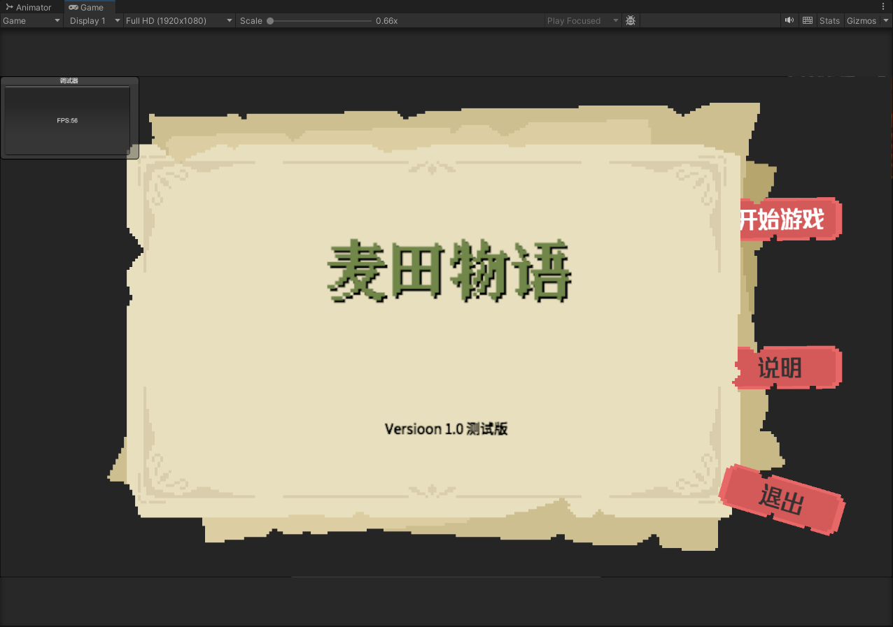
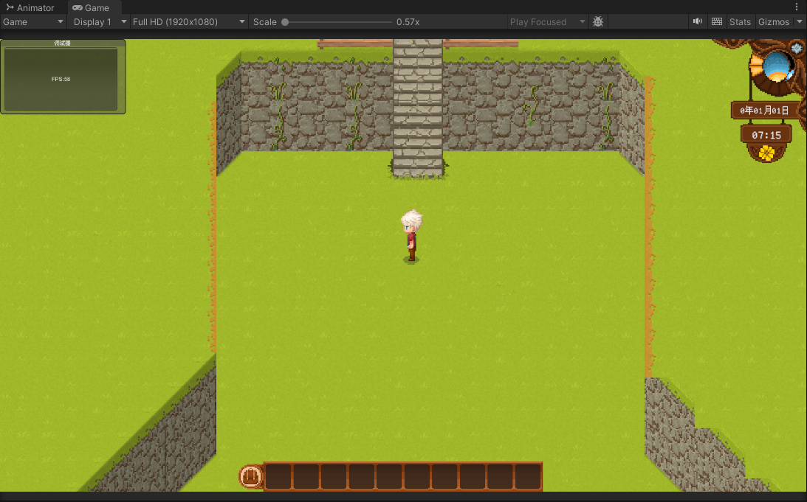
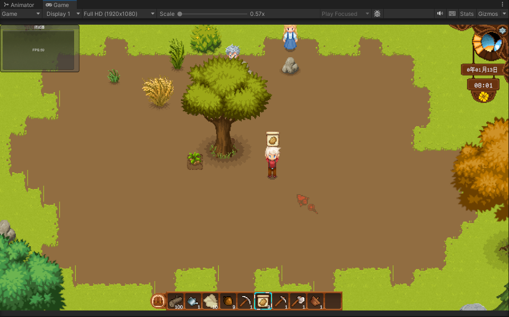
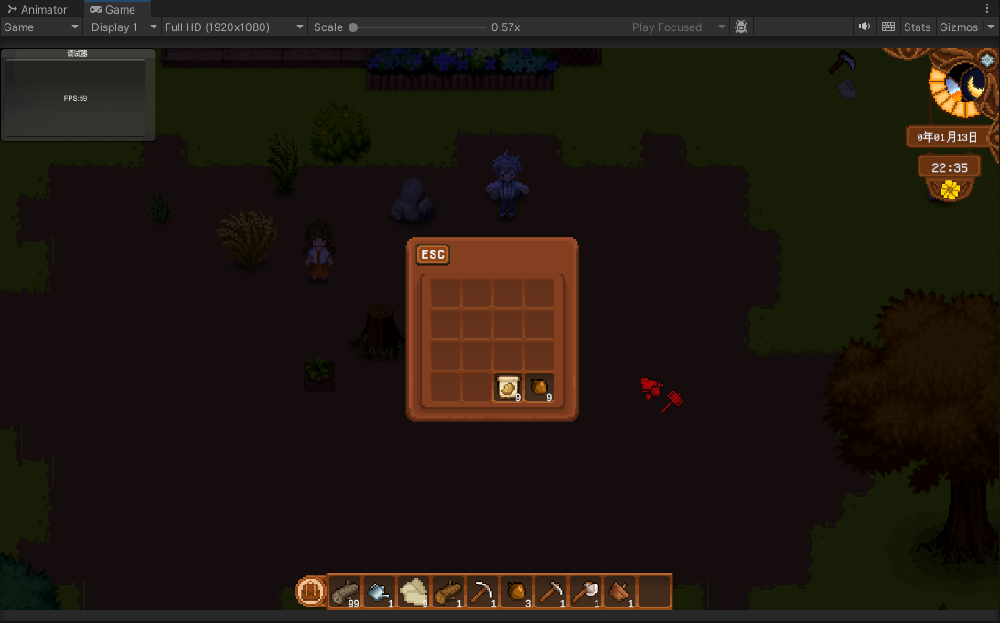
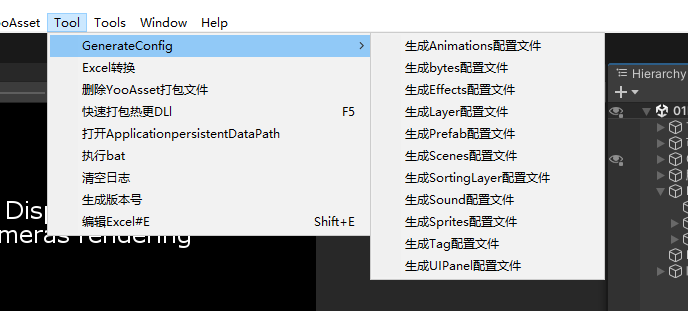
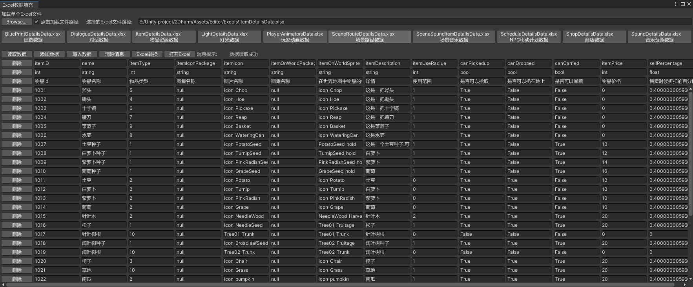

# 2DFarm

2d农场项目 unity2022.3.7f1国际版本

接入YooAsset HybridCLR Unitask替代协程

HybridCLR 热更现在暂时直接采用加载程序集方式实现

## 项目运行(如果不能报错的时候解决办法)

1. HybridCLR <https://github.com/focus-creative-games/hybridclr_unity.git>
2. UniTask <https://github.com/Cysharp/UniTask.git?path=src/UniTask/Assets/Plugins/UniTask>
3. YooAsset
4. 2D 一整套 feature里面的2D包含的所有的2D开发需要
5. Input System
6. Cinemachine
7. Universal RP

请导入以上的模块

## 效果图

## 接入简单的框架

1. **事件中心模块**->CoreEvent
2. **对象池模块**->CorePool
3. **Debug模块**->CoreDebug
4. **数据模块**->CoreData(数据通过byte文件加载)
5. **资源加载模块**->CoreResource(有一个资源加载接口，和实际实现的YooAsset加载方法，里面封装的YooAsset资源加载模式,等待资源加载采用unitask)
6. **场景切换模块**->CoreScene(创建场景接口，管理类中调用接口的实际实现方法)
7. **UI模块**->CoreUI(配合事件中心模块实现解耦合，全部采用监听方式执行数据传递，反向切换窗口采用栈集合实现)

## 其他子模块实现

1. **地图系统**->ModelGridMap(采用的unity自带的网格地图)
2. **音频管理模块**->ModelAudio
3. **建造模块**->ModelBuild
4. **庄稼种植模块**->ModelCrop
5. **对话模块**->ModelDialogue
6. **特效模块**->ModelEffects
7. **物品管理模块**->ModelItem
8. **世界物品管理模块**->ModelItemWorld
9. **灯管数据模块**->ModelLight
10. **NPC模块**->ModelNPC
11. **玩家模块**->Player
12. **数据存档和读档**->ModelSaveLoad
13. **商店模块**->ModelShop
14. **时间模块**->ModelTime
15. **过场剧情模块**->ModelTimeline
16. **场景切换模块**->ModelSwitchScene

以上子模块全都采用事件中心监听触发传递数据方式解耦合

## 编辑器拓展

代码还在继续更新中...
